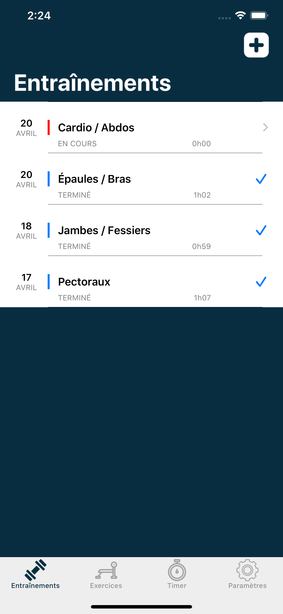
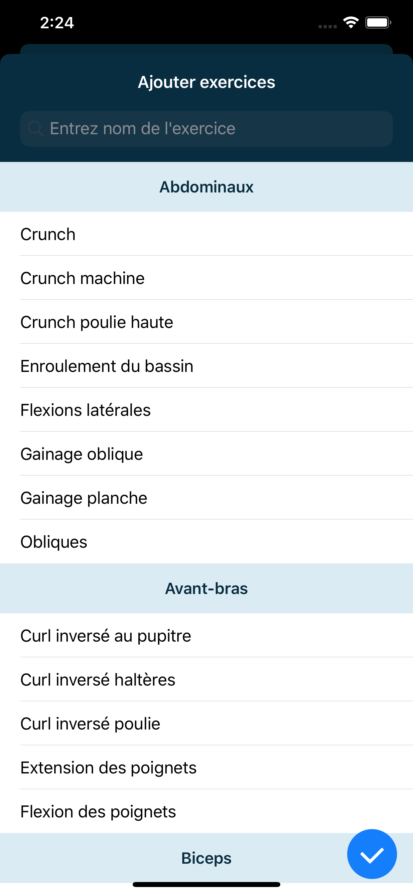

# FitInTime

FitInTime allows you to track your training, exercices, sets. An automatic timer is triggered for your rest time!

[Live demo](https://www.youtube.com/watch?v=6pxFXjwlL88)

## Features
  - Data storage
  - Automatic, interactive timer
  - Performance Summary generated (performances, muscle groups percentage...)
  - Put notes, rates for each training
  - Settings page to configure timer default value, timer auto launch...

## Screenshots

<table style="width:100%">
  <tr>
    <th>Workouts list </th>
    <th>Exercises list</th> 
  </tr>
  <tr>
    <td></td> 
    <td></td> 
  </tr>
    <tr>
    <th>Workout exercises list </th>
    <th>Performance registration</th> 
  </tr>
  <tr>
    <td></td> 
    <td></td> 
  </tr>
  <tr>
    <th>Performances list </th>
    <th>Timer</th> 
  </tr>
  <tr>
    <td></td> 
    <td></td> 
  </tr>
    <tr>
    <th>Workout comment and grade </th>
    <th>Workout summary</th> 
  </tr>
  <tr>
    <td></td> 
    <td></td> 
  </tr>
</table>
